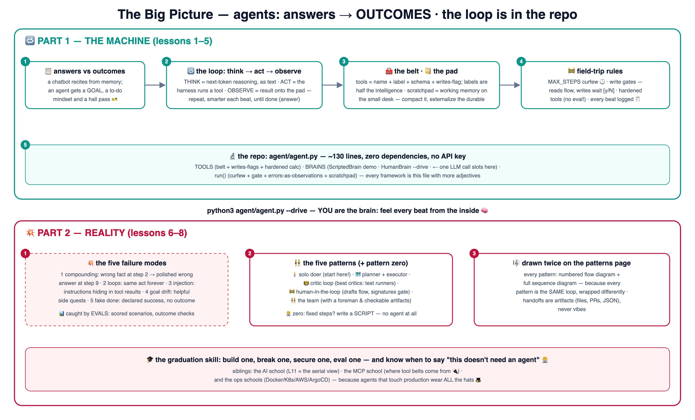

# 📋 Learn AI Agents the School Way — with a runnable agent

Chatbots answer; **agents achieve**. This school teaches the loop that makes the
difference — and ships it: **a real agent in the repo**, ~130 lines of pure Python,
zero dependencies, no API key.

🌐 **Interactive site:** **<https://baluraut.github.io/learn-agents-school/>** —
lesson cards, numbered diagrams, the big-picture 4K, and
**[5 agent patterns with flow + sequence diagrams](https://baluraut.github.io/learn-agents-school/patterns.html)**.

Siblings: [AI school](https://github.com/BaluRaut/learn-ai-school) (lesson 11 is the aerial
view of agents) · [MCP school](https://github.com/BaluRaut/learn-mcp-school) (where tool
belts come from) · plus [Kubernetes](https://github.com/BaluRaut/learn-kubernetes-school),
[Docker](https://github.com/BaluRaut/learn-docker-school),
[AWS](https://github.com/BaluRaut/learn-aws-school),
[ArgoCD](https://github.com/BaluRaut/learn-argocd-school).

## 🚀 The 60-second wow

```bash
python3 agent/agent.py            # a goal becomes an outcome: 6 steps, one gated write
python3 agent/agent.py --drive    # YOU are the brain — pick every action
```

Think 💭 → act 🧰 → observe 👀, printed beat by beat, with a real human gate 🚧 on the
file write and a MAX_STEPS curfew 🕐. Swap one class for an LLM API call and it's a
production-shaped harness.

## 🗺️ The big picture



## 🎓 The 8 lessons

Branches are **sequential** — branch 05 contains lessons 01–05.

| # | Branch | You learn | Analogy |
|---|---|---|---|
| 01 | `lesson-01-what-is-an-agent` | Answers vs outcomes | The reciter vs the doer with a hall pass 🎫 |
| 02 | `lesson-02-the-loop` | Think → act → observe (ReAct) | How you actually run errands 🔁 |
| 03 | `lesson-03-tools` | Tool design; reads vs writes | The belt — labels are half the intelligence 🧰 |
| 04 | `lesson-04-memory` | Scratchpad, compaction, durable memory | The pad, the small desk, the diary 📔 |
| 05 | `lesson-05-guardrails` | Curfew, write gates, hardened tools, logs | Field-trip rules 🚧 |
| 06 | `lesson-06-failures` | The five failure modes + evals | Confidently wrong, with momentum 💥 |
| 07 | `lesson-07-build-an-agent` | Read agent.py whole; three upgrades | 130 honest lines 🔬 |
| 08 | `lesson-08-patterns` | Solo, planner, critic, human gate, team | …and when NOT to use an agent 🙅 |

## 📦 What's in this repo (main branch)

```
learn-agents-school/
├── agent/agent.py   # the REAL agent: tools + swappable brains + guarded loop
└── docs/            # the GitHub Pages site (incl. the patterns page)
```
