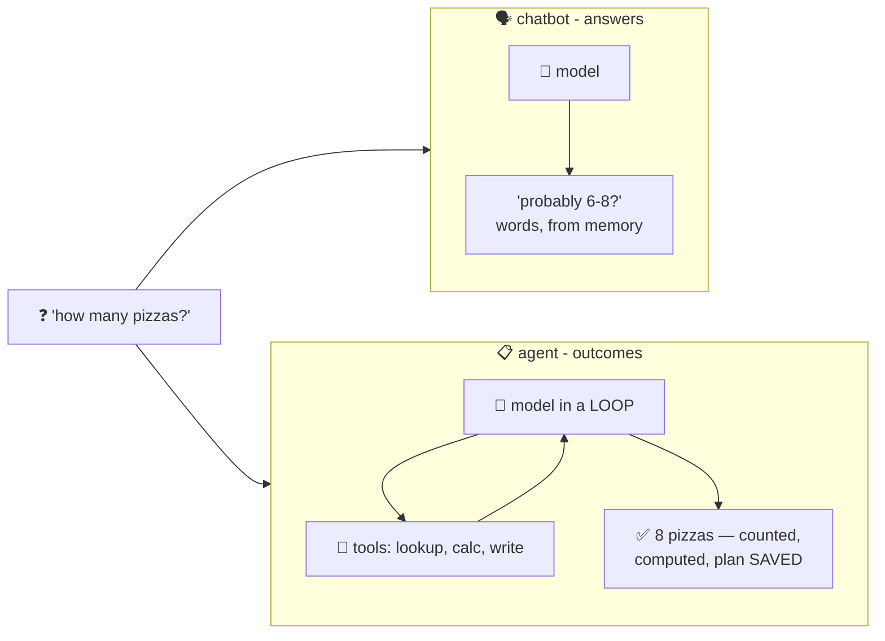

# 📋 Lesson 01 — What is an agent: answers vs outcomes

**📍 You are here:** Lesson **01** of 8 · Next: `lesson-02-the-loop`

---

## 📦 What's in this branch

The one distinction the whole course builds on — **chatbots answer;
agents achieve** — and a real agent you can run right now:
[agent/agent.py](../../agent/agent.py).

## 🧒 Explain like I'm 5

Two students, same brain, different jobs:

- **The reciter** 🗣️ (a chatbot): ask "how many pizzas for the picnic?"
  and it *answers from its head* — instantly, fluently… and it doesn't
  actually know how many kids are coming this year. You get words.
- **The doer** 📋 (an agent): give it the **GOAL** — *"figure out the
  pizzas AND save the plan"* — plus a **to-do list mindset** and a
  **hall pass** 🎫 (permission to go check things). It walks to the
  office, counts the classes, reads the pizza rule, does the math,
  writes the note, and comes back with the job DONE. You get an outcome.

The difference is not intelligence — it's the **loop and the pass**:
permission to act, look at what happened, and act again. Same model
that powers a chatbot becomes an agent the moment you wrap it in that
loop (which is exactly what this repo's ~130 lines do).

## 🗺️ Diagram



## ❓ What

- **Agent** = model + tools + loop + goal (AI course L11's formula —
  this whole school unpacks it term by term).
- The interface shift: chatbots take *questions*, agents take *goals*.
  Goals need decomposition, tools, and verification — that's lessons
  02–06.
- Spot them in the wild: coding assistants that edit-and-test, support
  bots that actually look up your order, research tools that browse and
  compile. Same loop, different tools.
- Honesty from day one: the loop also *compounds mistakes* (lesson 06)
  and *acts on the world* (lesson 05's guardrails). Power and risk
  arrive together.

## 🤔 Why

"Agent" is the most-abused word in AI marketing. After this course you
can replace the buzzword with a checklist: what's the goal? which
tools? what loop? which guardrails? If a product can't answer those,
it's a chatbot in a trench coat. 🕵️

## 🧪 Try it (60 seconds)

```bash
python3 agent/agent.py
```

Watch a goal become an outcome in six steps: three lookups, one
calculation, one (gated!) file write, one `done`. That printout is the
entire subject of this course — by lesson 07 you'll have read every
line that produced it.

## ⏭️ Next

The engine itself: **think → act → observe**, and why that tiny cycle
is the whole trick.

```bash
git checkout lesson-02-the-loop
```
