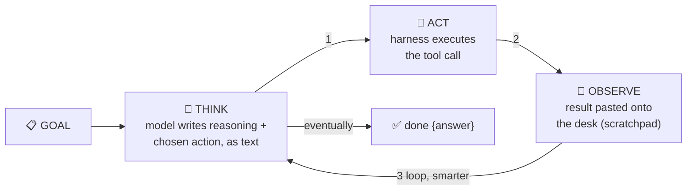

# 🔁 Lesson 02 — The loop: think → act → observe

**📍 You are here:** Lesson **02** of 8 · Previous: `lesson-01-what-is-an-agent` · Next: `lesson-03-tools`

---

## 📦 What's in this branch

Lesson 01, **plus** the engine: the three-beat cycle every agent runs,
and why each beat matters.

## 🧒 Explain like I'm 5

How do YOU run an errand? Not with a perfect plan — with a **cycle**:

1. **THINK** 💭 — *"Pizzas… first I need to know how many kids."*
2. **ACT** 🧰 — walk to the office and ask (use a tool).
3. **OBSERVE** 👀 — *"3A has 12."* New fact! It changes what's next.
4. …back to THINK, now smarter. Repeat until **done**.

The magic is beat 3: the world **answers back**, and the next thought
uses the answer. A plan made entirely up front would break at the first
surprise ("3B is on a field trip!"); the loop absorbs surprises — one
observation at a time.

Now the punchline from the AI course (L05/L11): the THINK beat is
literally **next-token prediction** — the model writes its reasoning
and its chosen action *as text*. The harness executes the action and
pastes the observation back onto the desk (L08). The loop is a
conversation between a text-predictor and reality. That's all "ReAct"
(Reason + Act — the pattern's academic name) means.

## 🗺️ Diagram



## ❓ What

- **One beat, in our code** ([agent.py](../../agent/agent.py)): `brain.decide(goal,
  scratchpad)` (THINK) → tool dispatch (ACT) → `observation` appended
  to `scratchpad` (OBSERVE). The `for step in range(...)` line IS the
  agent.
- **Termination**: a special `done` action — the model *decides* it's
  finished. Plus a hard `MAX_STEPS` backstop, because "eventually" is
  not a guarantee (lesson 05).
- **The scratchpad is the loop's memory** — every next thought sees all
  previous act/observe pairs (lesson 04 goes deep).
- Errors ride the same rails: a failed tool returns an error STRING,
  the model reads it and adapts — "errors are data" (MCP school L06).

## 🤔 Why

Every agent framework — however grand — is this loop with accessories.
When an agent misbehaves, debug it AS a loop: which beat failed?
Thought wrong (bad reasoning/prompt)? Act wrong (bad tool/schema)?
Observation missing or misleading (bad tool output)? The triage
instinct transfers from the k8s course's lesson 16: symptoms →
which part of the machine.

## 🧪 Try it — be the loop

```bash
python3 agent/agent.py --drive
```

You're the THINK beat now. Feel it: after each observation you *know
more*, and your next move changes. Try deliberately skipping the
lookup and calc from memory ("eh, 6 pizzas") — congratulations, you've
recreated the chatbot from lesson 01, and the plan is wrong. The loop
exists because looking beats remembering. 👀

## ⏭️ Next

The ACT beat deserves its own lesson: **tools** — the hands of the
agent, and how to design them well.

```bash
git checkout lesson-03-tools
```
