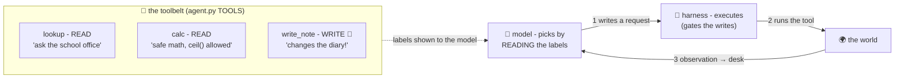

# 🧰 Lesson 03 — Tools: the agent's hands

**📍 You are here:** Lesson **03** of 8 · Previous: `lesson-02-the-loop` · Next: `lesson-04-memory`

---

## 📦 What's in this branch

Lessons 01–02, **plus** the ACT beat in detail: what a tool IS, how the
model chooses one, and the design rules that decide whether your agent
works.

## 🧒 Explain like I'm 5

The doer-student carries a small **toolbelt** 🧰, and each tool has a
label written FOR the student:

> `lookup {"topic": …}` — ask the school office
> `calc {"expression": …}` — the calculator
> `write_note {"text": …}` — write in the class diary **(changes things!)**

Three facts about the belt:

1. **The labels are half the intelligence.** The model picks tools by
   READING their names, descriptions and argument forms. Vague label →
   wrong tool, wrong arguments, or no call at all. Writing tool
   descriptions is prompt engineering with a screwdriver.
2. **The model never touches the tool.** It *writes a request* ("calc:
   ceil(23/3)"); the **harness** executes and returns the result — the
   same model-proposes/harness-disposes split as MCP school L02. Which
   is why…
3. **Tools split into reads and writes.** `lookup` can't hurt anyone —
   let it flow. `write_note` changes the world — it's labeled
   `"writes": True` in our code and the harness GATES it (lesson 05).
   Sorting your tools into these two buckets is the first security
   review, done in one minute.

And where do belts come from at scale? **MCP** — the standard socket
(the [whole other school](https://baluraut.github.io/learn-mcp-school/)):
plug in servers, and their tools appear on the belt automatically.

## 🗺️ Diagram



## ❓ What

- **Tool = name + description + argument schema + implementation.**
  Our `TOOLS` dict has exactly these (plus the `writes` flag — steal
  that pattern).
- Design rules that matter in practice: one job per tool; explicit,
  constrained arguments (enums beat free strings); return CONCISE
  text the model can use (a screenful, not a database dump — the desk
  is small, AI L08); errors as readable strings ("errors are data").
- `calc` shows defensive implementation: an AST-walking evaluator that
  allows numbers and `ceil()` and nothing else — because tool INPUT
  comes from a model that can be confused or injected (lesson 06).
  Never `eval()` what a model wrote. Never.
- The `done` pseudo-tool: termination as just another labeled choice.

## 🤔 Why

Agent quality tracks tool quality more than model quality. A mediocre
model with five crisp, well-labeled, well-scoped tools beats a frontier
model with `do_stuff(anything)`. When your agent flails, read it your
tool labels out loud — if YOU wouldn't know which to pick, neither does
the model.

## 🧪 Try it

```bash
python3 agent/agent.py --drive
# your move> calc {"expression": "ceil((12+11)/3)"}
# your move> calc {"expression": "__import__('os')"}     ← try to break it 😈
```

The second call fails safely — read `_safe_eval` in
[agent.py](../../agent/agent.py) to see why. Then design, on paper, the
toolbelt for YOUR job: five tools, one line each, marked READ or
WRITE. That artifact is 80% of an agent spec.

## ⏭️ Next

The desk between the beats: **memory** — scratchpads, context limits,
and why long tasks need a diary.

```bash
git checkout lesson-04-memory
```
