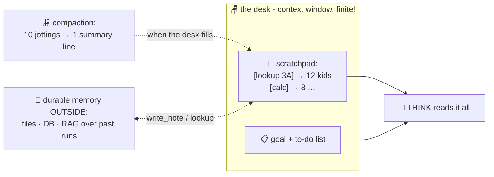

# 📔 Lesson 04 — Memory: the scratchpad and the homework diary

**📍 You are here:** Lesson **04** of 8 · Previous: `lesson-03-tools` · Next: `lesson-05-guardrails`

---

## 📦 What's in this branch

Lessons 01–03, **plus** what the agent *remembers* between beats — and
what happens on tasks too big to remember.

## 🧒 Explain like I'm 5

Watch the doer-student work: after every errand they jot one line in a
**scratchpad** 📔 — *"office says 3A has 12"*, *"calc says 8"*. Before
every new thought, they re-read the pad. That pad IS the agent's
working memory — in our code, literally a list of strings
(`scratchpad.append(...)`) shown back to the brain each beat.

But the pad lives on the **desk** (AI course L08!) — and the desk is
small. Long tasks fill it: fifty tool results, each a screenful, and
suddenly the early facts slide off or drown in the middle. The student
forgets why they started. 🫠

Real agents fight desk-overflow like a good student would:

- **Summarize as you go** 🗜️ — replace ten old jottings with one line:
  "counted both classes: 23 kids total." (Compaction.)
- **Keep a separate to-do list** ✅ — the GOAL and progress live in a
  structured plan the harness maintains, not just prose on the pad —
  so "what's left?" survives any amount of noise.
- **Write things DOWN outside your head** 📁 — files, databases, notes
  (our `write_note`!). The desk is for *working*; durable facts belong
  in durable places the agent can re-`lookup` later.
- **Long-term memory between tasks** = exactly RAG (AI course L10):
  embed past experiences, retrieve the relevant ones next time. Memory
  isn't a new invention — it's the open-book exam pointed at your own
  history.

## 🗺️ Diagram



## ❓ What

- **Working memory** = the prompt each beat: goal + tool labels +
  scratchpad(-summary). Our toy shows the pure form; production adds
  compaction thresholds and structured plans.
- **The desk math**: N beats × M tokens/observation must fit the
  context window — this is THE scaling wall for long tasks. Tools that
  return concise text (L03) buy you more beats.
- **Durable memory**: files/DBs the agent reads and writes via tools;
  survives the task, the session, the desk.
- Design smell: an agent that "forgets" mid-task usually has a desk
  problem, not a model problem — same diagnosis energy as k8s L16.

## 🤔 Why

"Why did it forget my instruction from step 3?" and "why does it fall
apart after 30 steps?" are the two most-asked agent questions in
production, and both are THIS lesson: the desk filled, and nobody was
compacting or externalizing. You now know the fix before you hit it.

## 🧪 Try it

```bash
python3 agent/agent.py --yes && cat note.txt && rm note.txt
```

Spot all three memories in one run: the **scratchpad** (printed
jottings feeding each THINK), the implicit **to-do** (the brain checks
"what's not done yet?" against the pad), and the **durable note**
(survives the process — that's why `cat` works after the agent exits).
Then a paper drill: your agent must audit 500 invoices; the desk fits
20. Design the memory plan (batch, summarize per batch, write running
totals to a file, final pass over the file — congratulations, that's
the production pattern).

## ⏭️ Next

Power tools + a tireless loop = a student who can also get it wrong at
scale. **Guardrails** — the field-trip rules.

```bash
git checkout lesson-05-guardrails
```
