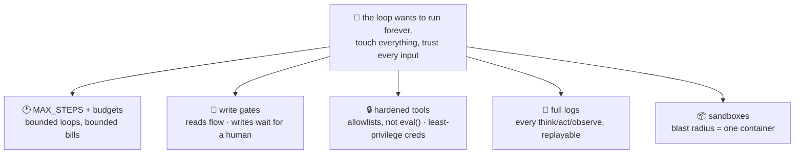

# 🚧 Lesson 05 — Guardrails: the field-trip rules

**📍 You are here:** Lesson **05** of 8 · Previous: `lesson-04-memory` · Next: `lesson-06-failures`

---

## 📦 What's in this branch

Lessons 01–04, **plus** the rules that make it safe to hand a tireless
loop real capabilities — every one implemented in
[agent/agent.py](../../agent/agent.py).

## 🧒 Explain like I'm 5

The school lets students run errands — WITH field-trip rules taped to
the door. Ours, and where each lives in the code:

1. **🕐 Be back by lunch** (`MAX_STEPS = 8`): however the errand goes,
   you stop after N steps. No student wanders forever; no loop burns a
   month of tokens overnight. Hitting the limit prints a proud
   "🛑 guardrail, not a bug" — because a stop you designed IS success.
2. **🚧 Permanent-marker actions need the teacher** (the write gate):
   tools flagged `"writes": True` pause for a human `[y/N]` before
   running. Reads flow; writes wait. One `if` statement — arguably the
   most valuable line in the file.
3. **🔒 Tools that can't be tricked** (`_safe_eval`): tool inputs come
   from a persuadable model reading untrusted text — so the calculator
   parses an AST allowlist instead of `eval()`. Build tools as if the
   caller might be confused, because sometimes it is (lesson 06).
4. **🧾 Every step on the record** (the printed log): think, act,
   observe — numbered, visible, replayable. When something goes wrong,
   the log answers "what happened?" (CloudTrail instincts — AWS L06).

And the rules production adds on top: **budgets** (tokens/money/time),
**sandboxes** (containers! — the Docker course suddenly reappears 🍱),
**scoped credentials** (an agent's tools wear least-privilege hats,
AWS L03–05), and **kill switches** humans can always reach.

## 🗺️ Diagram



## ❓ What

- **The gate taxonomy**: auto-allow (reads) · confirm (writes) ·
  forbid (never-tools: delete_all, transfer_money — don't put them on
  the belt at all). The belt IS the permission model.
- `--yes` (our auto-approve flag) exists for demos and CI — and is
  exactly the "always allow" toggle you should distrust in real hosts
  (MCP school L07 said the same: that toggle deletes the human gate).
- Guardrails compose with MCP: servers declare, hosts gate, agents
  log — three layers, same philosophy.
- The uncomfortable truth: guardrails cost convenience. Teams that
  remove them "temporarily" become case studies. Budget the friction.

## 🤔 Why

Lesson 01 promised outcomes; outcomes mean touching the world; touching
the world means the failure modes have consequences. The difference
between "cool demo" and "deployed agent" is not a better model — it's
these five boring rules, present and tested. Boring is the goal (the
k8s course's motto returns).

## 🧪 Try it — feel each rule

```bash
# rule 2 — the gate, live:
python3 agent/agent.py            # at the GATE prompt, answer N
# → "denied by the human — pick another way": the loop ADAPTS, goal continues

# rule 1 — the curfew:
python3 agent/agent.py --drive    # just keep calling lookup, 8 times
# → "🛑 stopped: hit MAX_STEPS" — the wandering student comes home

# rule 3 — the hardened tool:
# your move> calc {"expression": "__import__('os').system('echo pwned')"}
# → tool error — the allowlist held 🔒
```

## ⏭️ Next

What actually goes wrong when it goes wrong: **failure modes** —
compounding errors, loops, injection — and how evals catch them.

```bash
git checkout lesson-06-failures
```
