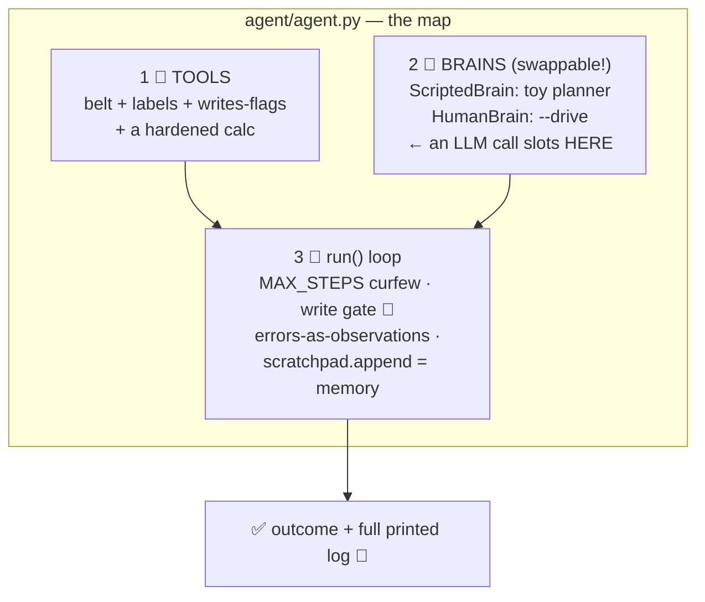

# 🔬 Lesson 07 — Build an agent: 130 honest lines

**📍 You are here:** Lesson **07** of 8 · Previous: `lesson-06-failures` · Next: `lesson-08-patterns`

---

## 📦 What's in this branch

Lessons 01–06, **plus** the guided read of
[agent/agent.py](../../agent/agent.py) — every concept from this
course, findable at a line number.

## 🧒 Explain like I'm 5

Open the file. Three numbered sections, exactly matching the course:

1. **🧰 THE TOOLS** — the belt (L03): `SCHOOL_DB` (the world),
   `_safe_eval` (a tool hardened against tricky input — L05 rule 3),
   three tool functions, and the `TOOLS` registry where every entry
   carries `help` (the label FOR the model) and `writes` (the gate
   flag). Notice `done` is just another labeled choice.
2. **🧠 THE BRAINS** — the THINK beat, swappable:
   - `ScriptedBrain` — a toy planner (an if-ladder over the
     scratchpad) so the demo runs with **no API key**. Its docstring
     is the course's biggest secret: *replace this class with one LLM
     call — "here's the goal + pad + tool labels, what next?" — and
     everything else stays.* The loop is the agent; the model is a
     part.
   - `HumanBrain` — `--drive` mode: you, typing. The fact that a
     human slots in where the LLM goes tells you exactly what an LLM
     contributes: decisions, nothing else.
3. **🔁 THE LOOP + GUARDRAILS** — `run()`: the `for step in
   range(MAX_STEPS)` curfew (L05 rule 1), THINK/ACT printed, the
   `done` exit, unknown-tool and error handling as *observations*
   ("errors are data"), the write gate `if TOOLS[name]["writes"] and
   not auto_approve` (L05 rule 2 — the most valuable `if` in the
   file), and `scratchpad.append(...)` — the memory (L04) in one line.

~130 lines. No framework. Every agent framework you'll ever meet is
this file with more adjectives.

## 🗺️ Diagram



## ❓ What (details worth stealing)

- **The `writes` flag on every tool** — a one-field permission model
  that scales surprisingly far before you need real policy.
- **Brain as an interface** (`decide(goal, scratchpad) → (name, args,
  thought)`) — makes the agent testable (script a brain!) and
  upgradeable (swap models without touching the loop).
- **Deterministic world for evals** — `SCHOOL_DB` is fixed, so
  outcomes are assertable (lesson 06's eval ran against it).
- Where MCP snaps in: replace the `TOOLS` dict with "list tools from
  connected MCP servers" (MCP school L07's client!) and the belt
  becomes plug-and-play. The two schools are two halves of one
  machine.

## 🤔 Why

Frameworks are fine — but debugging one without this mental model is
archaeology. After reading 130 lines you know what every layer of
LangGraph/CrewAI/whatever is FOR, which knob maps to which concept,
and — most valuable — what you *don't* need for a given job. Simple
loops with good tools and gates ship.

## 🧪 Try it — three upgrades, ~5 lines each

```bash
# A) new tool: add "list_notes" (READ) that returns note.txt contents.
#    → belt entry + function. Rerun --drive and call it.
# B) loop detection (L06 #2): in run(), before acting —
#    if scratchpad and f"[{name} {json.dumps(args)}]" in scratchpad[-1]:
#        observation = "you just did exactly that — try something else"
# C) real brain: replace ScriptedBrain.decide with an API call that
#    sends goal + scratchpad + tool helps and parses "name {json}".
#    (~15 lines with any LLM SDK — the harness doesn't change at all.)
python3 agent/agent.py --drive
```

Ship upgrade A at minimum. You're no longer a person who "used an
agent framework" — you're a person who could write one. 🔬

## ⏭️ Next

The finale: how single loops combine into **patterns** — planners,
critics, teams, human-in-the-loop — and when NOT to use an agent at
all.

```bash
git checkout lesson-08-patterns
```
