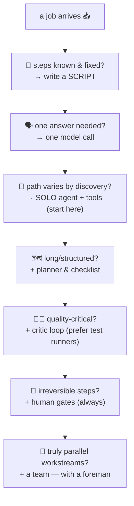

# 🌍 Lesson 08 — Agent patterns: teams, critics, and when NOT to

**📍 You are here:** Lesson **08** of 8 — the final lesson!

---

## 📦 What's in this branch

The complete course, **plus** the five patterns real deployments use —
each drawn twice (numbered flow + sequence diagram) on
**🌐 [the patterns page](https://baluraut.github.io/learn-agents-school/patterns.html)** ← open it beside this.

## 🧒 The five patterns, in school words

**1. 🧍 The solo doer** (single agent + tools) — our agent.py: one
student, one belt, one loop. **Start here, stay here as long as you
can** — most real value ships in this shape.

**2. 🗺️ Planner + executor** — one student BREAKS DOWN the project
("research trip: 1 pick city, 2 book train, 3 pack list"), then works
the checklist item by item (or hands items to doers). Structure beats
heroics on long tasks — the to-do list from L04, promoted to a
first-class artifact.

**3. 🧑‍🏫 The critic loop** (generate → check → fix) — one student
writes, another GRADES against a rubric ("tests pass? cites sources?"),
and the writer fixes until the grade is green. The critic can be a
model, but the BEST critics are merciless and mechanical: test
runners, compilers, linters (ground truth beats opinions — L06).

**4. 🚧 Human-in-the-loop** — the student prepares everything; a human
approves the irreversible step (deploy, send, pay). You've met this
gate in every school now (L05 here, MCP L05, ArgoCD's sync button) —
because it's THE pattern civilization runs on: drafts flow, signatures
gate.

**5. 👯 The team** (multi-agent) — researcher, writer, checker, each
with its own belt and desk, passing artifacts. Powerful for genuinely
parallel work; also multiplies cost, latency and L06's compounding
(a wrong "fact" from the researcher poisons everyone downstream).
Teams need a foreman: clear handoffs, checkable artifacts, one
responsible output.

**And pattern zero — no agent at all** 🙅: if the steps are known and
fixed, write a SCRIPT (cheaper, deterministic, debuggable). If it's one
model call, make one call. Agents earn their complexity only when the
path genuinely varies by what's discovered along the way. The best
agent architects say "this doesn't need an agent" weekly.

## 🗺️ Diagram (the decision, compressed)



## ❓ What (the checklist you'll reuse)

- Every pattern is **composition of the same loop** — L02's three
  beats, wrapped differently. Read any framework's diagram and you'll
  now see: planners are brains with structured output; critics are a
  second loop whose tools are graders; teams are loops passing
  artifacts.
- **Artifacts over vibes**: patterns work when handoffs are checkable
  things (files, PRs, JSON) — not chat transcripts.
- **Evals per pattern** (L06): solo = outcome checks; critic = does
  the grade actually correlate with quality?; team = end-to-end AND
  per-role.
- **Cost sanity**: each added role multiplies tokens & latency. The
  patterns page marks where each pattern pays for itself.

## 🧪 Try it — capstone

Take a real recurring task from your week. Walk the decision diagram
honestly (script? one call? solo?). If an agent survives the walk:
write its one-page spec — goal, belt (tools marked READ/WRITE), memory
plan, guardrails, the eval that proves it worked — and sketch its
sequence diagram in the patterns-page style. That page IS the
deliverable a team can build from. 📋

## 🎓 The doer graduates

Answers → outcomes → the loop → the belt → the pad → the rules → the
failure catalog → the file itself → the patterns. **You can now build
an agent, break one, secure one, eval one — and, rarest skill of all,
decline to build one.** 📋🎓

```bash
git checkout main
python3 agent/agent.py --drive    # one last errand, for fun
```
